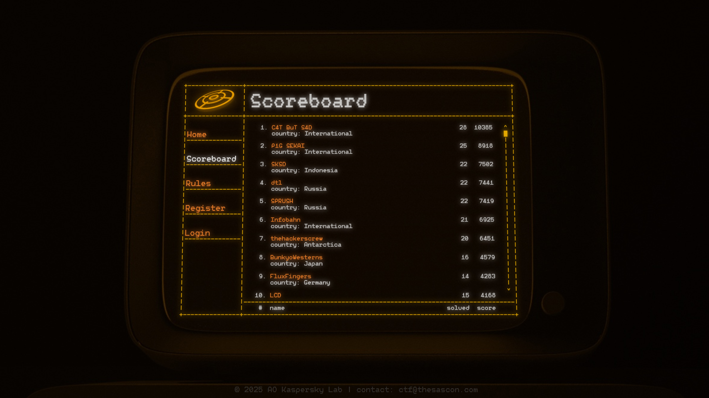

# SAS CTF 2025 Quals

https://ctf.thesascon.com \
https://ctftime.org/event/2636

**Flag format:** SAS{}  
**Duration:** 24 hours

## Partners
- [Kaspersky Academy](https://academy.kaspersky.com/)
- [OtterSec](https://osec.io)
- [Drovosec](https://drovos.ec)

## Organization team
**Project Lead:** [@bzvr](https://github.com/bzvr) \
**Development Lead:** [@kumfc](https://github.com/kumfc) \
**DevOps:** [@kochanac](https://github.com/kochanac) \
**Platform backend:** [@kochanac](https://github.com/kochanac) \
**Platform frontend:** [@kumfc](https://github.com/kumfc) (PASECA Sans by [@twosd](https://t.me/twosd))

## Tasks

| Name | Category | Authors |
|------|----------|---------|
|[Sanity Check](tasks/welcome-sanity-check/)|welcome|[@kumfc](https://github.com/kumfc)|
|[Drift Chat](tasks/web-drift-chat/)|web|[@kochanac](https://github.com/kochanac)|
|[Proxy](tasks/web-caddy/)|web|[@kochanac](https://github.com/kochanac)|
|[Bubble Tea Diaries](tasks/web-bubble-tea/)|web|[@omaramin17](https://github.com/omaramin17)|
|[Burmalda](tasks/web-burmalda/)|web|[@MaksTresh](https://github.com/MaksTresh) & [@kumfc](https://github.com/kumfc)|
|[GigaUpload](tasks/web-filesharing/)|web|[@sos1somba](https://t.me/sos1somba) & [@kumfc](https://github.com/kumfc)|
|[Goofy Ahh Frontend](tasks/misc-devtools/)|misc, web|[@kumfc](https://github.com/kumfc)|
|[WX Underground](tasks/misc-wx-underground/)|misc|[@bzvr](https://github.com/bzvr)|
|[Faceless Void](tasks/misc-faceless-void/)|misc, ai|[@bzvr](https://github.com/bzvr) & [@oda02](https://github.com/oda02)|
|[SCP-522](tasks/crypto-scp-522/)|misc, crypto|[@try-h4rder](https://github.com/try-h4rder)|
|[bigbabycode](tasks/crypto-bigbabycode/)|crypto|[@bzvr](https://github.com/bzvr)|
|[Blindspot](tasks/crypto-blindspot/)|crypto|[@oda02](https://github.com/oda02)|
|[A Mule Stealer](tasks/mlw-mule-stealer/)|malware|[@gkucherin](https://github.com/gkucherin)|
|[Best Teams Forever](tasks/mlw-teams/)|malware|[@gkucherin](https://github.com/gkucherin)|
|[Music Speed Changer](tasks/mlw-music-speed-changer/)|malware|[@gkucherin](https://github.com/gkucherin)|
|[Decompression](tasks/reverse-decompression/)|reverse|[@3vilWind](https://github.com/3vilWind)|
|[Sigma DSP](tasks/reverse-sigma-dsp/)|reverse|[@3vilWind](https://github.com/3vilWind)|
|[Washing Machine](tasks/reverse-washing-machine/)|reverse|[@3vilWind](https://github.com/3vilWind)|
|[it Sova](tasks/web3-sova/)|reverse, web3|[@spacewasp](https://github.com/spacewasp)|
|[posOSix I/II](tasks/reverse-pososix/)|reverse, misc|[@b1ad3runn3r](https://github.com/b1ad3runn3r) & [@kumfc](https://github.com/kumfc)|
|[Library](tasks/minecraft-library/)|minecraft|[@irdkwmnsb](https://github.com/irdkwmnsb)|
|[Down the Herobrine's Pit](tasks/minecraft-cave-diving/)|minecraft|[@irdkwmnsb](https://github.com/irdkwmnsb)|
|[Astigmatism](tasks/minecraft-astigmatism/)|minecraft|[@irdkwmnsb](https://github.com/irdkwmnsb)|
|[Trust Issues](tasks/pwn-optee-ta/)|pwn|[@m4drat](https://github.com/m4drat)|
|[Broken Trust](tasks/pwn-optee-kernel/)|pwn|[@m4drat](https://github.com/m4drat)|
|[Mickey 1337](tasks/pwn-mickey-1337/)|pwn|[@try-h4rder](https://github.com/try-h4rder)|
|[My Type](tasks/pwn-my-type/)|pwn|[@try-h4rder](https://github.com/try-h4rder)|
|[Lirili Larila](tasks/stego-lirili-larila/)|stego|[@oda02](https://github.com/oda02) & [@kumfc](https://github.com/kumfc)|
