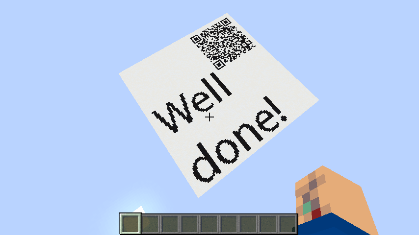

## Title
Astigmatism

## Description
Step back from the screen and, every 20 minutes, gaze 20 feet away for 20 seconds. Keep the lighting soft, not too dim or too harsh, and remember to blink so your eyes don't dry out. Finally, for each hour you play, take a 15-minute break - stretch your legs, sip water, and let your eyes rest.

For this challenge you will need Iris Shaders mod installed

HINT: Have you seen that guy named Entropy? He is laying low somewhere.

## Solution
We're provided with a minecraft world and a shader. On the first world load we can see the plane consisting of black and white wool. After enabling the shader we can see that the entire plane changes it's texture when we fly around in the world.
1. Lets break down the shader, the main logic is in the gbuffers_terrain.fsh.  
2. It's a xor encryptor that is using a random key derived from the player camera position and the block coordinate.  
3. Replicate the shader logic in python.  
4. Extract the starting plane state from the world as a png image using tools like amulet-core.  
5. Knowing that the task is about seeing something, bruteforcing coordinates outside of the render distance or for the weird angles is unreasonable. For X Z, let's start from the range that equals size of the plane (0, 100). Plane disappears on the height of ~280, so let's take (1, 280) for Y.
6. We also have an entropy-related hint. Let's start from the optimization in which we measure randomness of only one row in the resulting plane texture. Normally, relation of black and white in a single noisy row lies in the range of ~1.7-0.4, so let's note down if this value goes beyond that limit.
7. Checking all possible X, Y, Z in above defined range for a single row will take around 1 minute. At the `15 93 90` row becomes full white. You can now apply this to the whole image and save the result. But we will check it in the game (with style). `93` is a camera position, so we need to subtract 1 to get the player position. Use `/tp 15 92 90` and grab the flag.

## Flag
SAS{h4_h4_g3t_5quar3d_glsl_enj0y3r}

**Solved by:** 7 teams
