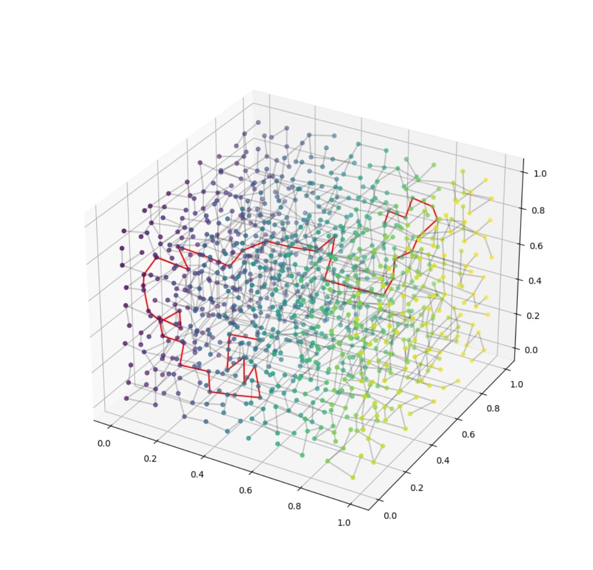

## Title
Down the Herobrine's Pit

## Description
Many cave divers perished on this challenging path. Hope you like to stretch and squeeze.

Version: 1.21.5

## Solution
We're given a minecraft server connection info. Upon connecting, we are spawned in a bedrock jail with a few blocks of wood and a single-block hole in the wall.

First part is easy. Craft a crafting table and a fence gate. Use them to change the player hitbox to the crawling mode and squeeze into the hole. 

On the next part we are provided with a huge amount of trap doors and a seamlessly endless cave labyrinth going up and down. There are two approaches to the solution.

### First approach
Patch the existing pathfinder (e.g. Baritone or Mineflayer) to count single-block holes as a passable path (normally they don't). If you choose to patch the Baritone, it will draw a path to the desired coordinates rights in the game and you'll have to just follow it. To get the flag coordinates either download the regions from the server (using mineflayer, litematica etc.) and observe locally or use freecam mod to find the chest.

### Second approach
1. Dump regions from the server.
2. Reconstruct the labyrinth into non-planar graph.
3. Run any pathfinding algorithm on the graph (we suggest using networkx), note down coordinates of the "bulbs" among the path and perform the beloved cave-diving part on the server.

Shortest path is mostly going down, so making it through on the server when you know the way will last you around 15 minutes.

## Flag
SAS{c4v3_d1v3rs_f0r_n0_r34s0n_wh3n_th3y_h3ar_th3r3_1s_a_d1amond_d0wn_th3_h3r0br1n3s_p1t}

**Solved by:** 19 teams