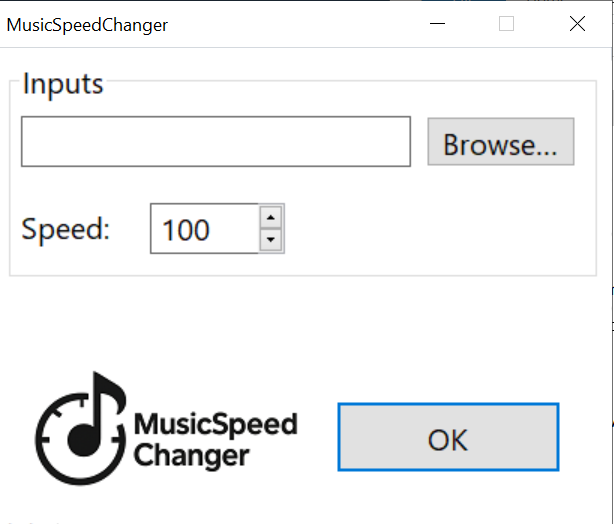
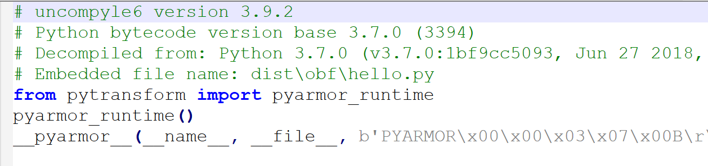
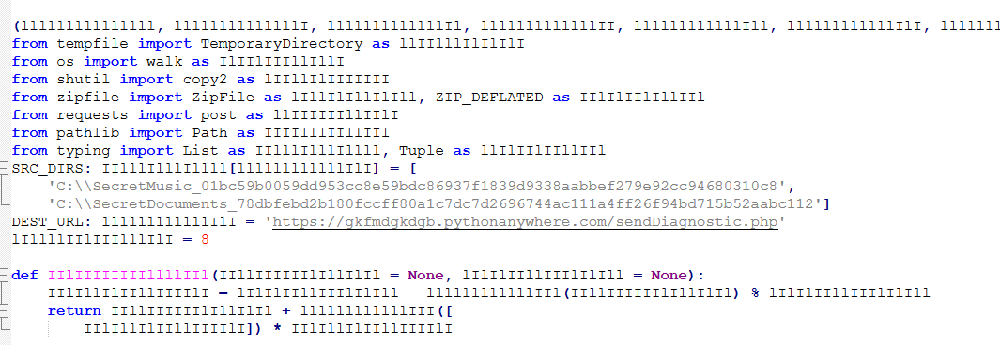

# Music Speed Changer - Writeup

The file included with the challenge is a [mitmproxy](https://mitmproxy.org/) dump of HTTP/HTTPS traffic. The description of the challenge mentions a software that allows its user to control the speed of music. To solve the challenge, participants needed to identify malicious connections logged inside the dump, analyze malicious payloads establishing them, and decrypt information exfiltrated by them.

## Step 1 - Anomalous network behavior detection

The provided dump file includes mostly legitimate connections, such as Google searches. However, the dump as well contains traces of suspicious behavior related to the ```musicspeedchanger[.]online``` website. For example, these traces can be identified with the following methods:
- Using the hint from the challenge about the music speed changer software and searching for domains related to such software;
- Scanning the traffic request and response bodies for large blobs of data, specifically EXE files;
- Extracting the list of domains from the dump and examining their popularity - the ```musicspeedchanger[.]online``` domain was created just a few days before the CTF.

By visting the ```https://musicspeedchanger[.]online``` website it is possible to note that it hosts a web page allowing to download a software named MusicSpeedChanger. Downloads of this software can be as well observed in the network traffic.
<p align="center"></p>

## Step 2 - MusicSpeedChanger software analysis

 The file found on the MusicSpeedChanger software website, as well as inside the traffic dump, is a NSIS installer of the MusicSpeedChanger software, which can be unpacked with 7-Zip. It includes two notable files:

 - ```MusicSpeedChanger.exe```, the main executable of the music speed changing software, which has the following interface:

   <p align="center"></p>
 - ```upd.exe```, an updater component of the software, which is configured by the installer to run on startup via a scheduled task.

Reverse engineering of the main software executable can reveal that it is non-malicious. It is designed to accept the music file path and the desired speed from the user, and use the ```ffmpeg``` executable to perform the speed conversion.

However, the upd.exe file looks much more suspicious. It is designed to periodically make GET requests for the URL ```https://musicspeedchanger[.]online/fetcher.php?uid=<machine unique ID>``` to fetch update files. These files are then decrypted with Blowfish (key: ```56348f7aab9113074228473470bbc401```) and executed.

## Step 3 - Analysis of update files found in traffic

By examining the traffic file, it is possible to establish that the infected machine made 3 requests to the aforementioned update URL to receive update files. It is afterwards possible to decrypt the update payloads present in traffic with the previously mentioned Blowfish key, for example by using [CyberChef](https://gchq.github.io/CyberChef/). These payloads are NSIS installers that can further be unpacked with 7-Zip. The contents of these payloads are as follows:

- The first payload is designed to drop documentation files to the MusicSpeedChanger software installation directory;
- The second payload is designed to launch a 5 MB executable, named ```sendDiagnostics.exe```, embedded inside the installer;
- The third payload is designed to replace the ffmpeg binary present in the MusicSpeedChanger software installation directory.

Among these payloads, the second one looks the most suspicious and needs to be further analyzed. 

## Step 4 - Analysis of the ```sendDiagnostics.exe``` payload

The ```sendDiagnostics.exe``` file is a PyInstaller-packed executable. A standard [workflow](https://hshrzd.wordpress.com/2018/01/26/solving-a-pyinstaller-compiled-crackme/) while working with such executables is to first extract the compiled Python script (```.pyc```) files from them, and then decompile the ```.pyc``` files into Python code.

The extraction can be done with the [pyinstxtractor](https://github.com/extremecoders-re/pyinstxtractor) utility, by using the ```python.exe pyinstxtractor.py sendDiagnostics.exe``` command. This command will create a directory named ```sendDiagnostics.exe```, with a notable file named ```hello.pyc``` inside.

Having obtained this file, it is possible to decompile it, for example using the [uncompyle6](https://pypi.org/project/uncompyle6/) decompiler. However, the resulting decryption results turn out to be cryptic, as demonstrated by this screenshot:

  <p align="center"></p>

The decompiled code includes the string ```pyarmor```, evidencing use of the [pyarmor](https://github.com/dashingsoft/pyarmor) obfuscator. To remove this introduced obfuscation, it is possible to attempt to extract the payload [dynamically](https://github.com/Svenskithesource/PyArmor-Unpacker) or use a static analysis-based utility named [BoneDensity](https://github.com/nesrak1/bonedensity). The deobfuscated code represents a payload that looks as follows:

 <p align="center"></p>

 This payload is designed to exfiltrate files to the ```https://gkfmdgkdgb.pythonanywhere[.]com/sendDiagnostic.php``` C2 server, encrypted with 3DES (key: ```1b6e2fe573ee6620ff85e66b784a7b07a803bd383810c0e4```, IV: ```2563e3e1a8d774f6```). Having determined that, it is possible to extract the encrypted payload sent to this server from traffic, which will reveal the flag: `SAS{n3v3r_g0nn4_g1v3_up_u51ng_unp0pul4r_50ftw4r3}`
