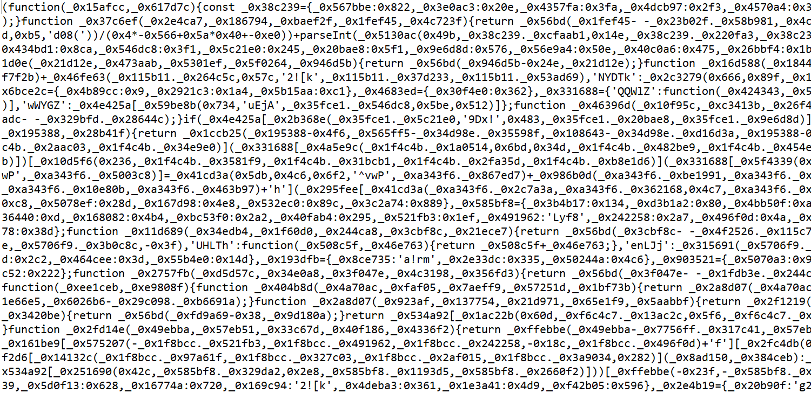
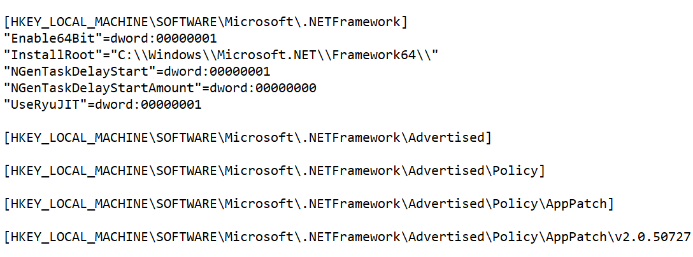

# Best Teams Forever - Writeup

The description of the challenge mentions a suspicious Microsoft Teams installation which caused a ransomware incident. Challenge statement includes an archive with this installation. To solve the challenge, participants needed to extract the ransomware code, analyze it, and decrypt the provided encrypted file.

## Step 1 - Application code extraction

The archive with the Teams installation includes a ```Teams.exe``` executable, signed by Microsoft. It is a legitimate Electron application engine, designed to interpret a Node.JS payload stored inside the  ```resources\app.asar``` file. The raw payload can be extracted from this file through any of the methods available in answers to this [Stack Overflow question](https://stackoverflow.com/questions/38523617/how-to-unpack-an-asar-file), for example by using the ```asar``` archiver itself or by using a 7-Zip plugin for working with .asar files. The source code of the application can be further found in the ```index.js``` file.

## Step 2 - Application code analysis

The application code present in the ```index.js``` file is obfuscated, as demonstrated by the screenshot below:

<p align="center"></p>

To analyze this file, it is, for example, possible to beautify it with any appropriate tool and then analyze the beautified code dynamically, or try various source code deobfuscators by trial and error. An example of a deobfuscation tool helping to significantly simplify the application source code is [synchrony](https://github.com/relative/synchrony). 

Analysis of the source code reveals the following actions being performed:

- The payload iterates over subkeys of the ```HKEY_LOCAL_MACHINE\SOFTWARE\Microsoft``` registry key. It uses these subkeys to generate an AES key and IV, used for file encryption;
- For every key, the payload generates a random number from 0 to 4000. If the generated value is 0, the malware calculates the SHA256 hash of the full registry key path and uses it as the encryption key;
- After selecting the AES key, the payload continues iterating over the registry keys, generating random numbers in the same way as described. As soon as the payload generates a zero number, it calculates the MD5 hash of the currently iterated registry key path and uses it as the AES IV;
- When the encryption key and IV are generated, the payload iterates over files stored in the ```C:\\sasctf_77a44d458a057afe4beed9de71923f65e1fcf230baa916d48359dd8926826521``` directory. It encrypts the contents of each file with the AES key and IV, as well as encrypts the key and IV themselves with an RSA public key. The encrypted file contents, consisting of RSA and AES ciphertexts, are written to files with the ```.enc``` extension, and the original file contents are deleted.
- After all files are encrypted, the payload drops a ransom note.

## Step 3 - Decryption wordlist construction

It can be observed that the AES key and IV, used to encrypt file contents, are derived from names of Windows registry keys, which can be quickly brute-forced. The challenge description includes the operating system version of the infected machine, which is  ```Windows Server 2019 Standard (17763.3650)```. This makes it possible to install this version of Windows Server and export a list the subkeys of the ```HKEY_LOCAL_MACHINE\SOFTWARE\Microsoft``` registry key. This can be done with the ```reg export HKEY_LOCAL_MACHINE\SOFTWARE\Microsoft list.txt``` command. 

The obtained ```list.txt``` file has the following contents: 

<p align="center"></p> 

As can be observed from the screenshot, the file contains names of both registry keys and values. As the ransomware code works only with registry keys, it is further required to extract the names of keys, which start with the ```[HKEY_LOCAL_MACHINE\SOFTWARE\Microsoft``` string, from the ```list.txt``` file. This can be done with the following Python script:

```python
with open("list_edited.txt", "w") as g:
    with open("list.txt", 'r',encoding='utf-16le') as f:
        for line in f:
            if line.startswith('[HKEY_LOCAL_MACHINE\SOFTWARE\Microsoft'):
                g.write(line.replace('[', '').replace(']', ''))
```
The resulting wordlist (available inside the writeup directory) consists of around 100,000 key candidates.

## Step 4 - File decryption
Once the wordlist is constructed, it is possible to use the following Python script to brute-force the AES keys used for encryption. As the AES IV affects only the first 16 bytes of the CBC ciphertext, it is not necessary to bruteforce it in the script.
```python
from Crypto.Cipher import AES
from hashlib import sha256

AES_CIPHERTEXT_OFFSET = 0x100

def decrypt_aes256_cbc(ciphertext, key):
    iv = b'\x00' * 16
    cipher = AES.new(key, AES.MODE_CBC, iv)
    return cipher.decrypt(ciphertext)

with open('important.txt.enc', 'rb') as f:
    ciphertext = f.read()
with open('list_edited.txt', 'r') as g:
    for line in g:
        key = sha256(line.strip().encode()).digest()
        try:
            plaintext = decrypt_aes256_cbc(ciphertext[AES_CIPHERTEXT_OFFSET:], key)
            if b'SAS{' in plaintext:
                print(plaintext)
                break
        except Exception as e:
            print(e)
            continue
    else:
        print("Fail")
```

Executing this script will yield the flag: `SAS{N0_M0r3_R4n50m_f0r_53rv3r5}`
