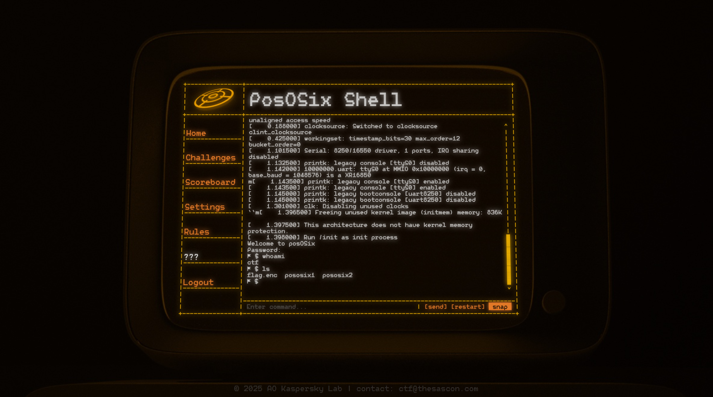

## TItle
posOSix I/II

## Description
See this trail of the mystery on the bottom left corner of your screen? If not, reset your cache for the platform frontend (CTRL+F5 or whatever is equivalent on Safari) 

Once you're there and it kindly asks you to provide a password - whisper "12345" and give it some time to shake up. Flag for this part of the challenge derives from the same-called entity.

## Solution
We're given an emulated linux that runs directly in the browser. There are two binaries in the home folder - `pososix1` and `pososix2`, each of them is a separate task. For the solution, refer to the [posOSix I writeup](./writeup/posOSix_I.md) and [posOSix II writeup](./writeup/posOSix_I.md)

The emulator is a JavaScript port of [cnlohr's mini-rv32ima](https://github.com/cnlohr/mini-rv32ima), code can be found in `./sources/emulator/emu.js`.

Provided `buildroot.patch` applies over [cnlohr's fork of buildroot](https://github.com/cnlohr/buildroot).

## Flags

**posOSix I:** `SAS{c0n6r4tul4t1on5_0N_f1ndin6_7h3_p4Th_tHr0u6h_th3_w4rm_b47h}` \
**Solved by:** 6 teams

**posOSix II:** `SAS{1_l0v3_thr33_th1ng5_sp_n3ts_r15cv32_4nd_cr4ckm3s}` \
**Solved by:** 1 team
