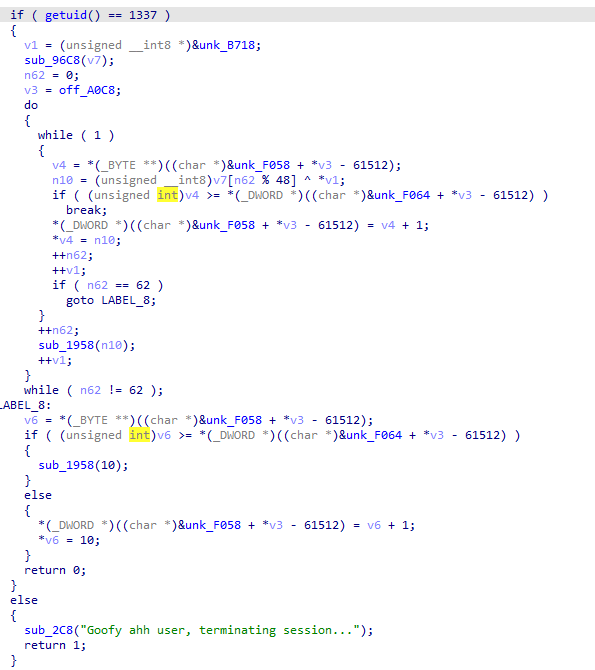

# posOSix I

## Solution 1
Firsty, lets do some reconnaissance. Starting up, we can see that the executable for this task is locked from us by belonging to user `sas` and having `0700` access rights. Thats why, lets carve it out of the image and fire up the favourite decompiler.

`main` function of the task binary actually looks like this:



Function `getuid()` does a syscall 174, which is actually `getuid` syscall. If it is equal to 1337, we continue the execution. Lurking around `sub_96c8`, we may see, that according to the error strings, various info gets collected and undergoes some cryptographic operations. 

In `sub_9988` we see the following writeback:
```c
_DWORD *__fastcall sub_9988(_DWORD *result)
{
  *result = 0;
  result[1] = 0;
  result[2] = 0x67452301;
  result[3] = 0xEFCDAB89;
  result[4] = 0x98BADCFE;
  result[5] = 0x10325476;
  return result;
}
```

By searching the web, we can find that these constants are used in MD5 hashing. Function `sub_1cb8` is what actually performs it - it calculates hash from the provided data and writes it to te passed `_BYTE *` pointer. So, the final pointer data would look like this:
```
MD5(release) | MD5(/proc/cmdline) | MD5(BUILDROOT_ID)
```

with release being data acquired by `uname().release` and BUILDROOT_ID from environment (humble remainder that `/proc/cmdline` is a non-existent file in reality and fread will read 0 bytes, so MD5 will hash an empty buffer)


Examining the binary further uncovers us the next step - the created buffer (this will be 16 * 3 = 48 bytes) is used as a key in cyclic XOR decryption of some bytes. Now, we can implement a simple decryptor that will give us the flag.
```python
from Crypto.Hash import MD5

enc = bytes.fromhex('1159FA1A935FF40470AE9305DAA67995BB73B986BF4EED62D8EE6DF182CE1D49141EA91F37E8DFA3D0BE201CB49364C536709A3E875BE85F5DF8D347DEEF')

parts = [
    b'6.8.0-rc4posOSix',
    b'',
    b'riscv32-buildroot-linux-uclibc-gcc.br_real (Buildroot -g2984b8a740-dirty) 13.2.0, GNU ld (GNU Binutils) 2.40)']

key = []
for part in parts:
    h = MD5.new()
    h.update(part)
    for sym in bytes.fromhex(h.hexdigest()):
        key.append(sym)

dec = []
for i in range(len(enc)):
    dec.append(enc[i] ^ key[i % len(key)])

print(bytes(dec))
# b'SAS{c0n6r4tul4t1on5_0N_f1ndin6_7h3_p4Th_tHr0u6h_th3_w4rm_b47h}'
```
## Solution 2
TLDR: patch /etc/passwd in memory to make sas user enabled, then just run the binary

The second path is a bit trickier. Instead of reverse-enginering the application logic, lets consider patching approach. Emulator is running on the client side thus making it possible to arbitrary manipulate its internals - both source code (implementation logic) and internal memory.

Looking at the access right, we may notice, that `posOSix1` has `sas` owner, but its access right do not allow other users to perform any manipulations to the file.


To add up, as we know from the reversing part (described in the first solution variant), the binary checks whether the uid is equal to `1337`, which is the uid of the `sas` user. So, to launch this app, we need to be logged in as the aforementioned user, what is not possible now due to the configuration of `/etc/passwd` - user defaults to `/bin/false` shell.


Obtaining the kernel image is quite straightforward - you can either use some packet grabbin tool or just look through the emulator source code and find it at `/funny/pososix/image.img`. After firing up the hex editor, we can find the following occurence:


This can be patched to something like this:


This binary patch can be fed back to the emulator by patching the corresponding js code (this can be achieved e.g. via Local Override in Chrome) like this (loadEverything is a function that is preceding the emulator execution):
```js
async loadEverything() {
        const i = await fetch("/funny/pososix/dtb.img")
          , s = new DataView(await i.arrayBuffer())
          , r = await fetch("/funny/pososix/image.img")
          , o = new DataView(await r.arrayBuffer());
        const data = new Uint8Array([
    0x73, 0x61, 0x73, 0x3A, 0x3A, 0x31, 0x33, 0x33, 0x37, 0x3A, 0x31, 0x33, 0x33, 0x37, 0x3A, 0x6B, 
    0x65, 0x6B, 0x32, 0x3A, 0x2F, 0x68, 0x6F, 0x6D, 0x65, 0x2F, 0x73, 0x61, 0x73, 0x3A, 0x2F, 0x2F, 
    0x2F, 0x2F, 0x2F, 0x62, 0x69, 0x6E, 0x2F, 0x73, 0x68, 
    ]);
        const patch_offset = 0x1E5B00 + 8;
        for (let i = 0; i < data.length; ++i) {
            o.setUint8(patch_offset + i, data[i]);
        }
        this.loadDTB(s),
        this.loadKernelImage(o)
    }
```

We can now login as the desired user and just run our executable:

