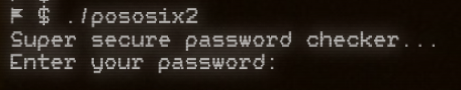
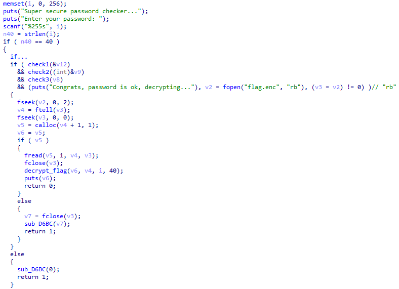
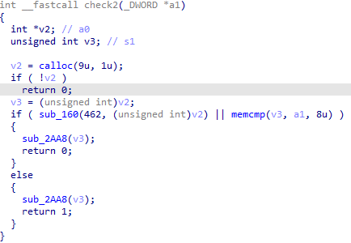
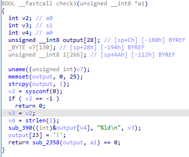
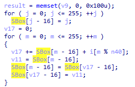

# posOSix II

When trying to launch the binary, we can see that it requests for some password with the following message:



Looks like a basic crackme. Lets examine the binary. Loading the decompiler and searching for usage of aforementioned strings, we can find the `main` function:



Here, we can see 4 checks of the password. First one checks that the length of it equals 40 bytes. Three others are bound to the separate parts of flag. Lets examing every single one

### Check 1
Here we can immediately see 2 interesting constants - `0xCAFEBABE` and `0xDEADBEEF`
```C
v11 = 0xCAFEBABE;
v12 = 0xDEADBEEF;
for ( i = 0; i <= 0xCAB; ++i )
	sub_D3DC(&v13, &v11);

for ( j = 0; j <= 0xCAB; ++j )
	sub_D3DC(&v14, &v12);
	
v13 == 0xAFFB9991 && v14 == 0xFF128124;
```

`sub_D3DC` looks like the following:
```c
  *(_DWORD *)a2 = HIBYTE_(*(_DWORD *)a2);
  for ( i = 0; i <= 3; ++i )
    a1[i] ^= a2[i];
  for ( j = 0; j <= 3; ++j )
    a1[j] = SBOX[(unsigned __int8)a1[j]];
  return permute((int)a1); // this one swaps (0, 2) and (1, 3) bytes
```

This is basically a SP network - it calculates round key, xores the input, does byte substituition and permutes the output. As soon as all of the operation are some kind of bijection, the input can be fully restored.

Now we know the first part of the secret - word `deeznuts`

### Check 2
This function looks like the following



Function `sub_160` does a syscall, but the problem is that there is no default syscall with number 462 in 6.8 kernel. In this case, we will have to dig into the kernel.

Statically finding the exact syscall implementation in the kernel might be hard. But if you observe dmesg after launching the binary, you may spot `SUSCALL` string, which may lead directly to the desired code. That syscall, in pseudocode, does the following:
```C
uint8_t key[] = {0x2a, 0x99, 0x6e, 0xb0, 0x2c, 0x37, 0x2e, 0x8b};
uint8_t enc[] = {0x4f, 0xf4, 0x1b, 0xdc, 0x4d, 0x43, 0x41, 0xf9};

uint8_t res[8] = {};
for (int i = 0; i < 8; ++i) {
	res[i] = key[i] ^ enc[i];
}

copy_to_user(output_buf, res, 8);
```

From there we can get the second part of the secret - word `emulator`

### Check 3
Here, in check 3, last password part consists of 3 subparts:



The result is created by concatenating all of them:
`uname().release | str(sysconf(**_SC_ARG_MAX**)) | !`, what results in `6.8.0-rc4posOSix2097152!`

### Flag decryption
In case all three checks pass, the binary prints corresponding message and proceeds to decryption. The decryption here is RC4 algorithm. It can be easily recognized by SBox generation:



Putting all that stuff together, we can now implement the decryption script
### Solution script

```python
from Crypto.Cipher import ARC4
import sys

# stage 1
inv_s = [212, 4, 34, 31, 51, 234, 16, 35, 122, 82, 118, 201, 13, 84, 136, 247, 90, 217, 75, 157, 48, 147, 18, 33, 2, 72, 0, 195, 100, 62, 240, 107, 97, 70, 171, 14, 221, 108, 184, 88, 112, 103, 165, 178, 190, 169, 83, 9, 242, 186, 248, 173, 211, 237, 209, 101, 233, 181, 23, 236, 224, 3, 78, 159, 61, 37, 141, 251, 185, 254, 166, 91, 192, 5, 143, 138, 71, 191, 12, 50, 144, 175, 148, 155, 77, 11, 205, 183, 96, 125, 188, 137, 119, 225, 168, 161, 36, 162, 27, 7, 20, 67, 10, 57, 208, 220, 42, 104, 207, 95, 25, 194, 6, 142, 26, 158, 170, 46, 41, 163, 202, 134, 196, 80, 130, 85, 15, 28, 127, 66, 110, 241, 243, 19, 38, 128, 22, 239, 63, 179, 177, 246, 231, 55, 68, 200, 219, 198, 245, 226, 123, 76, 65, 253, 154, 59, 129, 98, 199, 172, 228, 30, 89, 238, 149, 86, 227, 64, 222, 47, 53, 43, 121, 56, 8, 218, 214, 126, 111, 232, 106, 215, 133, 160, 1, 187, 116, 230, 203, 115, 204, 120, 229, 164, 79, 145, 252, 73, 29, 213, 189, 131, 102, 176, 74, 135, 180, 24, 156, 250, 44, 151, 244, 167, 174, 210, 206, 150, 197, 60, 216, 105, 139, 52, 92, 223, 45, 152, 87, 58, 117, 193, 94, 255, 69, 182, 40, 39, 109, 21, 132, 140, 32, 49, 93, 99, 54, 146, 153, 124, 235, 113, 17, 114, 81, 249]

def sp_round_key_inverse(b: int) -> bytes:
    t = int.from_bytes(b, 'little')
    t = ((t >> 8) | ((t << (32 - 8)) & 0xFFFFFFFF)) & 0xFFFFFFFF
    return t.to_bytes(4, 'little')

def sp_key_final(k: int, n: int) -> bytes:
    for _ in range(n):
        k = ((k << 8) | ((k >> (32 - 8)) & 0xFFFFFFFF)) & 0xFFFFFFFF
    return k

def sp_permute_inverse(b: bytes) -> bytes:
    b = list(b)
    t = b[0]
    b[0] = b[2]
    b[2] = t
    t = b[1]
    b[1] = b[3]
    b[3] = t
    return bytes(b)


def inv_sp_round(val: bytes, key: bytes) -> tuple:
    val = list(sp_permute_inverse(val))

    for i in range(len(val)):
        val[i] = inv_s[val[i]]

    for i in range(len(val)):
        val[i] ^= key[i]

    return (bytes(val), sp_round_key_inverse(key))
        

CT = [2952501649, 4279402788]
KEYS = [0xCAFEBABE, 0xDEADBEEF]
ITERS = 0xCAC
part_1 = []
for i in range(len(CT)):
    b_i = CT[i].to_bytes(4, 'little')
    fin_key = sp_key_final(KEYS[i], ITERS)
    fin_key = fin_key.to_bytes(4, 'little')
    for _ in range(ITERS):
        b_i, fin_key = inv_sp_round(b_i, fin_key)

    part_1.append(b_i)

part_1 = b''.join(part_1)

# stage 2

XOR_KEY = bytes([0x2a, 0x99, 0x6e, 0xb0, 0x2c, 0x37, 0x2e, 0x8b])
encrypted = bytes([0x4f, 0xf4, 0x1b, 0xdc, 0x4d, 0x43, 0x41, 0xf9])

part_2 = bytes([encrypted[i] ^ XOR_KEY[i] for i in range(len(encrypted))])

# stage 3

part_3 = b'6.8.0-rc4posOSix' + b'2097152' + b'!'
key = part_1 + part_2 + part_3
print(key)
# checks done, decrypting

with open(sys.argv[1], "rb") as enc_msg:
    rc4 = ARC4.new(key)
    print('[+] ' + rc4.encrypt(enc_msg.read()).decode('utf-8'))

# [+] This could have been a funny message, but I was too lazy to write it so here is your flag:
# SAS{1_l0v3_thr33_th1ng5_sp_n3ts_r15cv32_4nd_cr4ckm3s}
```
