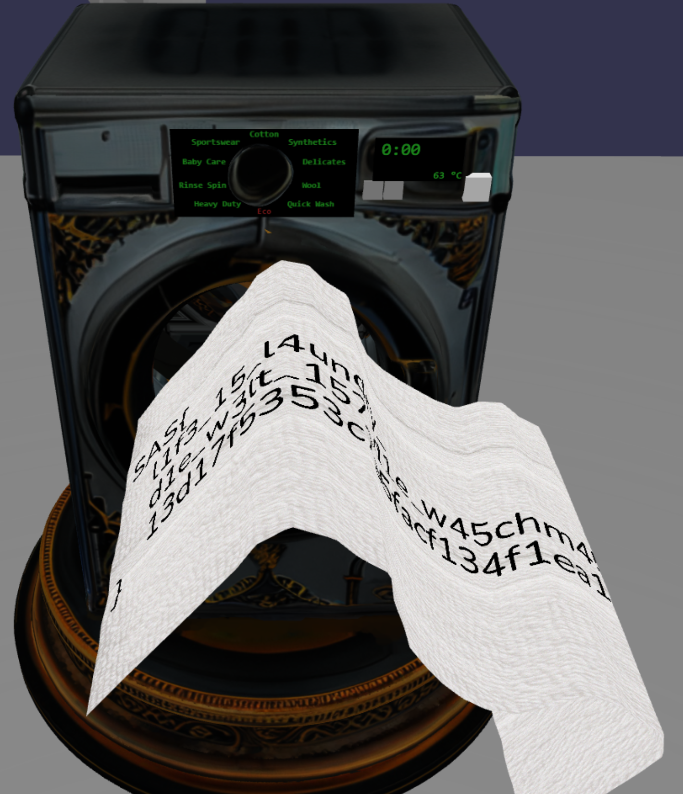

## Title
Washing Machine

## Description
Your flag has been spoiled. Only the Holy Washing Machine can save it, but be careful, She's got a twist.

## Solution
The task presents us with a 3D scene featuring a washing machine.
Initially, we observe a dirty towel flying into the machine.
On the towel, we can clearly see flag prefix `SAS{`.
If we're observant, we can also spot a suspicious tag on the side of the towel, which might be important.
Once the towel enters the washing machine, we're given control over the washing process.
We can select the wash mode using a dial, adjust the temperature using two buttons, and then start the cycle.
After starting the wash, the towel begins to spin inside the drum. Gradually, its texture transforms into noise and it breaks apart.
The washing cycle seems very slow.
When we open the browser's developer console, we can see that the Babylon.js WebGPU1 engine is used.
1) By checking the Network tab in the browser's developer tools, we can see that the page consists
of a single HTML file with no external dependencies. This means we can simply download it and
save it locally for further analysis.
2) In the same tab, we also notice several blob URLs being loaded from callstack with `createTexture` function.
Among them is a .webp image that closely resembles the tag we previously spotted on the side of the flying towel,
it contains washing instructions: it says the item should be washed at `63°C` on the `Eco` mode.
It sounds like a settings we should use to get the flag.
3) So, maybe we've already solved the challenge? We set the washing parameters based on what we found,
start the wash and... and... the same slow cycle begins, just like with any other setting.
We don't have time to sit through the entire cycle.
Let's dig into why the process is so slow — and whether there's a way to speed it up.
4) JS code in the file is minified into a single line (except some shader code), so run `js-beautify -r .\index.html` to make it more readable, open file in the browser, it's not broken and we can debug it this way.
5) In the washing machine scene, we see modes like `Cotton`, so search for this string in the code and start analyzing the surrounding logic. We are interested in the code that is executed when the start washing cycle button is pressed.
6) Looks like function (`_0x3840ab`) which uses these strings is used to update the screen texture.
This function is triggered via the `OnPointerOverTrigger` callback. After a quick search, we find [the official Babylon.js documentation](https://doc.babylonjs.com/features/featuresDeepDive/events/actions) and see that there's another event type: `OnPickTrigger`, which is described as: `Raised when the user touches/clicks on a mesh`.
That sounds exactly like what we're looking for.
7) There are lines `_0x5f2665['actionManager']['registerAction'](new xo(he['OnPickTrigger'], _0x350c53 => {`, and `const _0x5f2665 = _0x31a589['getMeshById']('btnStart');`. This is exactly what we are looking for.
8) Lets analyse this function. 
    - PRNG is initialised with selected washing settings `const _0x24b776 = nc['xoroshiro128plus'](_0x275e53['nMode'] * 0x64 + _0x275e53['nTemp']);`, some WebGPU buffers initialised with generated data. 
    - According to the [documentation](https://doc.babylonjs.com/features/featuresDeepDive/events/observables/#add-an-observer) `_0x31a589['onBeforeRenderObservable']['add'](() => {` registers a callback that is executed on every frame
    - The variable `_0x1b176c` looks like a state machine, it is used extensively
    within `onBeforeRenderObservable` callback.
    Initially, its value is `0`. When the washing cycle starts, it is set to `1`, and at certain points
    in the function, it is updated to `2`.
    - Within this observable, if `_0x1b176c == 2` and certain other conditions are met,
    a `setTimeout(() => {...}, 0x2710)` call is triggered
9) Try changing `0x2710` (which is `10000` milliseconds or `10` seconds) to `0` — this might be the reason
the wash cycle is so slow.
10) Now the washing cycle runs much faster and finishes quickly, leaving us with a towel broken into pieces.
However, unlike incorrect settings where the texture turns into noise, this time, using the correct parameters,
the towel's texture changes to mostly white by the end of the cycle. This suggests we're on the right track.
The towel isn't just disintegrated — it's clean, but still scattered.
So the next step is likely to reconstruct it somehow.
11) We notice that the code includes many WGSL shaders, which likely play a role in the transformations
during the washing process.
    - Since this challenge involves multiple WGSL shaders, it's worth taking a moment to understand what WebGPU is and how it works within [Babylon.js](https://doc.babylonjs.com/setup/support/webGPU/webGPUWGSL/).
    - Fortunately, there is an extension for chrome called
    [WebGPU Inspector](https://chromewebstore.google.com/detail/webgpu-inspector/holcbbnljhkpkjkhgkagjkhhpeochfal)
    that can help us analyze WebGPU activity.
    After installing the extension, we find that it doesn't work when opening the HTML file directly from disk.
    No problem — we can serve the file through a local web server or just use deployed unmodified page.
    We open the WebGPU Inspector panel and navigate to: WebGPU Inspect → Inspect → Objects → Textures.
    Here, we see a list of all the textures used in the scene. 
    Several of them contain the substring Flag0, Flag1, Flag2, Flag3, Flag4.
    Flag0 looks like a scrambled version of the dirty towel texture that we saw at the very beginning of the scene — the one that shows the prefix of the flag. The others (Flag1 through Flag4) appear to contain noise.
12) Let's start analyzing the shaders. It looks like the WGSL shader code is written using template strings with the tag literal `Ti`. Code of shaders is not obfuscated and easy to read with variable names.
13) We have `S['ShadersStoreWGSL']['flagVertexShader']` and `S['ShadersStoreWGSL']['flagFragmentShader']` shaders,
and bunch of compute shaders.
14) As we can see in one of the fragment shader, the color of each pixel is computed as an XOR of certain pixels
from all the noise-like textures (Flag1, Flag2, etc.).
The dirty towel texture (Flag0) is also used, but in a different role — it's blended with the XOR result using a mixing coefficient.
This explains the visual effect we observed during the washing cycle, at the beginning, we clearly see the original
dirty texture (with the flag prefix), but over time, it fades away and is gradually replaced by noise.
15) So, what we need is the pixel color from the final stage of the wash (xored textures).
However, we also want the geometry of the towel (its vertices) to remain undistorted — ideally forming a flat surface,
or at least resembling the original towel as it appeared at the beginning of the scene.
16) To achieve this, we need to take a closer look at the vertex shader.
Our goal is to keep vertexOutputs.position the same as it was at the beginning of the scene, before the wash cycle distorted the geometry.
At the same time, we want the other vertex attributes to remain as they are after the wash, because they carry the final visual result.
    - In other words, we need to decouple visual deformation from final color output
17) We can't simply freeze `input.xxx` to their initial values, because they are also used in computing `vertexOutputs.uv4Clamp`. Based on this, the ideal approach would be to store the initial values of `input.xxx` in a separate buffer
at the start. Then, we can use these preserved values specifically for computing `vertexOutputs.position`.
Meanwhile, the original `input.xxx` can continue to change throughout the washing process, since it may still be needed for other computations.
18) To implement this, let's follow an approach by referencing examples from the Babylon.js documentation.
    - Let's locate the call to setVerticesBuffer for the `input.xxx`. Duplicate this line, along with its corresponding buffer initialization, and rename the attribute to `xxx2`.
        ```
                    const _0x308ceb = new Ps(_0x2e2d45, _0x8d8453['byteLength'], G['BUFFER_CREATIONFLAG_VERTEX'] | G['BUFFER_CREATIONFLAG_WRITE']);
                    _0x57aeef['setVerticesBuffer'](new R(_0x2e2d45, _0x308ceb['getBuffer'](), 'xxx', !0x1, !0x1, 0x4, !0x1, 0x0, 0x4, R['UNSIGNED_INT']), !0x1), _0x308ceb['update'](_0x8d8453);
        +            const _0x308ceb2 = new Ps(_0x2e2d45, _0x8d8453['byteLength'], G['BUFFER_CREATIONFLAG_VERTEX'] | G['BUFFER_CREATIONFLAG_WRITE']);
        +            _0x57aeef['setVerticesBuffer'](new R(_0x2e2d45, _0x308ceb2['getBuffer'](), 'xxx2', !0x1, !0x1, 0x4, !0x1, 0x0, 0x4, R['UNSIGNED_INT']), !0x1), _0x308ceb2['update'](_0x8d8453);
                    let _0x3e4e87 = 0x0;
        ```

    - Next, in the vertex shader code, we declare a new input attribute `xxx2`, and modify the computation of `vertexOutputs.position` to use `input.xxx2` instead of `input.xxx`.
        ```
                    attribute xxx: vec4<u32>;
        +           attribute xxx2: vec4<u32>;
                    var<storage> quads : array<vec3u>;
                    var<uniform> params: f32;
        ```
        ```
                    fn main(input : VertexInputs) -> FragmentInputs {
                        var positionUpdated = vec3f(
        -                    f32(input.xxx.x & 0xfff) / f32(0xfff),
        -                    f32(input.xxx.y & 0xfff) / f32(2 * 0xfff),
        -                    -f32((input.xxx.x >> 12) & 0xfff) / f32(2 * 0xfff)
        +                    f32(input.xxx2.x & 0xfff) / f32(0xfff),
        +                    f32(input.xxx2.y & 0xfff) / f32(2 * 0xfff),
        +                    -f32((input.xxx2.x >> 12) & 0xfff) / f32(2 * 0xfff)
                        );
        ```
    - Finally, we add `xxx2` to the list of vertex attributes when creating the shader.
        ```
                    }, {
        -               'attributes': ['xxx'],
        +               'attributes': ['xxx', 'xxx2'],
                        'uniformBuffers': ['Scene', 'Mesh'],
                        'storageBuffers': ['quads'],
                        'shaderLanguage': Nh['WGSL']
        ```
19) Let's try running the wash cycle again using the correct parameters.
Our approach worked — this time, shape of the towel is preserved and we can clearly see that the flag rendered on the towel.
However, there's one issue: the towel is rotated away from the camera, making the flag difficult to read.
Let's fix that by adjusting the towel's orientation.
    - `_0x28e09c` is flag shader material, according to this line `_0x57aeef['material'] = _0x28e09c;`, `_0x57aeef` is the flag object, let's check its references
    - In the code for the initial towel flight animation, we can see that the position of the towel is being changed and a flight animation is applied to it.
    Let's try to remove update, and set animation final value the same as initial.
        ```
                        const _0x189766 = 0x1 * 0x3c,
                            _0x2d7dec = new hs('Group2'),
                            _0x495fbf = new H('flagMove', 'position', 0x3c, H['ANIMATIONTYPE_VECTOR3']);
        -                _0x57aeef['position']['addInPlace'](new L(0x0, 0.25, -0.25)), _0x495fbf['setKeys']([{
        +                _0x495fbf['setKeys']([{
                            'frame': 0x0,
                            'value': _0x57aeef['position']
                        }, {
                            'frame': _0x189766,
        -                    'value': new L(_0x1d7a31['x'] + 0.2, _0x1d7a31['y'] - 0.18, _0x1d7a31['z'] + 0.25)
        +                    'value': _0x57aeef['position']
                        }]), _0x495fbf['addEvent'](new _C(_0x189766, () => {
                            _0x3bf2a9 = !0x0;
                        }, !0x0)), _0x2d7dec['addTargetedAnimation'](_0x495fbf, _0x57aeef), _0x2d7dec['play']();
        ```
    - Great! The flag is now clearly visible, but it's rotating too quickly, making it hard to read or take a proper screenshot.
    Let's fix this by slowing down the rotation (We still need the rotation, since the flag is displayed on a curved surface, making it difficult to read from a single angle).
    - There's another section in the code where the flag's position is being modified.
    Let's try replacing 0x7d with 1000 to significantly slow down rotation.
    ```
    {
        const _0x3f5dbb = new qA('pivot', _0x31a589);
        _0x3f5dbb['position'] = _0x1d7a31['add'](new L(0x0, 0.1)), _0x57aeef['setParent'](_0x3f5dbb, !0x0, !0x0), _0x375d2a = _0x31a589['onBeforeRenderObservable']['add'](() => {
            _0x3f5dbb['addRotation'](_0x31a589['deltaTime'] / 0x7d, 0x0, 0x0);
        });
    }
    ```
    - We also want the rotation to continue after the washing cycle finishes.
    To achieve this, we need to prevent the rotation observer from being removed at the end of the cycle, so just remove `_0x375d2a['remove']()`


This challenge can be solved in many creative ways, and the walkthrough above describes just one possible approach.
1) If you didn't notice the tag on the towel, you could extract the .glb file containing the 3D scene, load it
into Blender, and explore the entire scene — including the texture of the tag.
Alternatively, you could brute-force all possible wash settings until you find
the correct combination — the one that doesn't transform the towel into noise.
2) Instead of duplicating the vertex buffer, there were a lot of other viable approaches you could have taken, for example:
    - Dump all vertex buffers and reconstruct the image outside the scene
    - Derive vertex positions in the shader based on `vertexIndex`
        - Although `vertexIndex` values are shuffled globally across the mesh, they are sequential within each quad.
        - This means you could build a mapping from `vertexId` to `position` per quad, and use that to reconstruct the geometry in the shader without relying on the original vertex buffer.

## Flag
SAS{l1f3_15_l4undry_d1e_w3lt_157_d1e_w45chm45ch1n3_13d17f5353c7a5facf134f1ea16a}

**Solved by:** 1 team