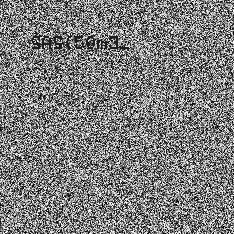
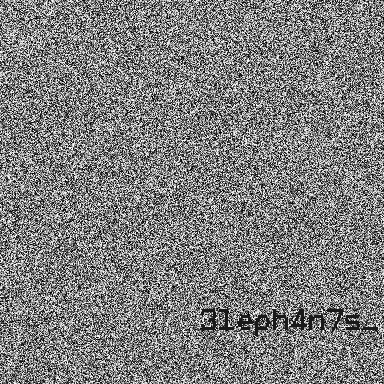

## Title 
Lirili Larila
 
## Description 
Please rate up my recent artwork made in a 10-hour lungo-infused drawing session
 
## Solution

GIF files can use a global palette (Global Color Table, GCT) or define a local palette (Local Color Table, LCT) for each frame. A critical observation when inspecting this GIF is that, within each palette, there are multiple entries mapped to the same color (e.g. RGB(255,255,255)), but at different palette indices.

This is not typical — normally each color is present only once in the palette. Here, different palette entries have the same color value, letting the author encode data with palette indices alone.

So, some hidden image or message might be hidden using only the palette indices, while being invisible when GIF is being played or converted to individual frames.

*Note:* If you'll try to extract the frames using Pillow, the hidden data will be lost: Pillow optimizes palettes, merging duplicate colors and destroying the unique palette index information. As a result, simply saving out or manipulating frames with Pillow will not reveal any hidden content.

To solve this, we wrote a custom [parser](./writeup/solve.py) to process the GIF binary format and:
- extract each frame’s palette indices (not just the pixel colors),
- generate images where each palette index is mapped to an unique grayscale value.

Here are several images with fragments of the flag, as revealed by the script:

  
  

 
## Flag
SAS{50m3_3leph4n7s_c4n_h1d3_7h31r_53cr3ts_1n_l0c4l_p4ll3tes}

**Solved by:** 26 teams