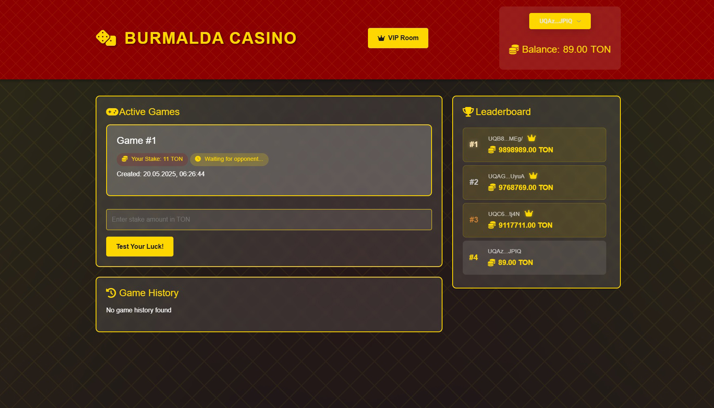
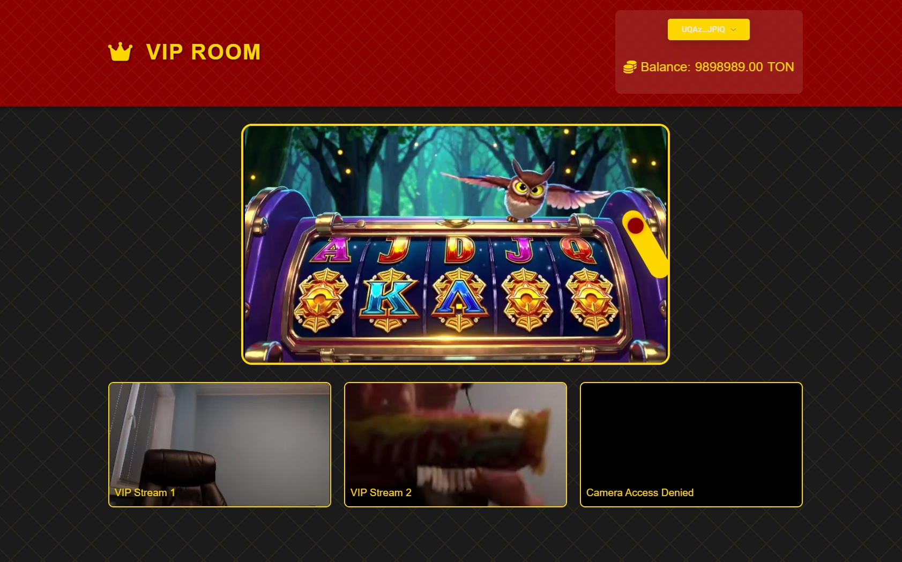

## Title
Burmalda

## Description
I've heard you have PhD in Games Theory. Ho-ho, interesting... How many games did you beat? Can you trick this one before it drains you dry?

## Solution
We're provided with a gambling website. It has:
- authentication via TON
- offchain balance with guaranteed freebet, no onchain deposits are implemented
- user vs user matchmaking
- unaccessible "VIP Room" endpoint
- a global scoreboard, in which 3 users are supposedly have a VIP status

Checking the source code, it becomes clear that we need to somehow obtain a VIP status to proceed. And since no code for the "VIP Room" is provided, it is yet unclear if there's a flag or a second part of the task.

Further analyzing, there's no indication that gaining any extra amounts to your balance will grant you the VIP status. So, maybe we need to somehow pull an account takeover.

As mentioned before, service uses TonConnect as an authentication method. TON wallet address is being used as an unique account identifier. TonProof object, produced by the `tonconnect` clientside library, is verified using `pytonconnect` package on the backend. This package is mentioned in the [official documentation](https://docs.ton.org/v3/guidelines/ton-connect/guidelines/verifying-signed-in-users) for verifying signed in users on the backend, so what can be wrong?

Check out the above mentioned docs. There's a step 6a/6b that is very unclear from the first glance. And it is actually very important, because on TON relativeness between wallet address and public key is not that straight as it is on other blockchains. As well as *PHP Example* from that page, `pytonconnect` entirely skips the `walletStateInit` check, making the account takeover exploitation as trivial as forming a valid TonProof message and signing it with your own keypair. There's also a trivial step of converting the address of the target user from *user-friendly* to *hex* format. For automated implementation refer to the [exploit](./writeup/exploit.py).

After logging in as a VIP user you can open the "VIP Room", pull the lever and get your prize (flag).

## Flag
SAS{fr0m_off1c14l_d0cum3nt4t10n_to_fr33_sp1n_on_gr33n_shm4}

**Solved by:** 7 teams